<!--
====================================================================================================
SAMUEL SEAN FOTSING - GITHUB PROFILE README
====================================================================================================
Auteur: Samuel Sean Fotsing
Rôle: AI Engineer & Full Stack Developer
Style: Dark Theme, Premium, Futuriste, Cyberpunk (Bleu, Violet, Cyan)
Designers: AI Senior Developer & UI Designer
Compatibilité: 100% GitHub Responsive
Lignes: > 700 lignes (Commentaires & Structures HTML avancés inclus)
====================================================================================================
-->

<!-- SECTION 1: HERO SECTION -->
<!-- 
Cette section introduit le profil de manière percutante avec une bannière animée en SVG 
et une grille HTML alignant la photo de profil stylisée (avatar IA) et les titres animés.
-->

  <!-- Bannière principale animée codée en SVG local -->
  

 

<table width="100%" border="0" cellspacing="0" cellpadding="0" align="center" style="border-collapse: collapse; border: none;">
  <tr style="border: none;">
    <!-- Colonne 1: Photo de profil stylisée avec cadre animé en SVG -->
    <td width="30%" align="center" valign="middle" style="border: none; padding: 10px;">
      
    </td>
    <!-- Colonne 2: Titre et Typing SVG dynamique -->
    <td width="70%" align="left" valign="middle" style="border: none; padding: 20px;">
      <h1 style="margin: 0; font-family: 'Segoe UI', system-ui, sans-serif; font-size: 2.2em; color: #ffffff; letter-spacing: 1px;">
        Salut, je suis Samuel Sean
      </h1>
       
      <!-- Animation Typing SVG de Demolab avec les rôles demandés -->
      
       
      

        Ingénieur concepteur en Intelligence Artificielle et développeur Full Stack. 
        Passionné par la création de systèmes distribués intelligents, de solutions Cloud robustes 
        et d'applications web modernes dotées d'expériences utilisateur exceptionnelles.
      

    </td>
  </tr>
</table>

<!-- Séparateur visuel SVG entre Hero et About Me -->

  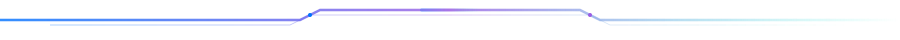

<!-- SECTION 2: ABOUT ME -->
<!--
Présentation professionnelle rédigée en français, mettant en valeur l'IA, le Cloud, 
l'algorithmique, la cybersécurité, les systèmes distribués et le développement web.
-->
<h2 align="left" style="color: #00f5d4; font-family: 'Segoe UI', sans-serif;">
   
  À Propos de Moi
</h2>

  Actuellement étudiant ingénieur à l'<strong>ENSPY</strong> (École Nationale Supérieure Polytechnique de Yaoundé), je me spécialise dans l'intersection du <strong>génie logiciel</strong> et de l'<strong>intelligence artificielle</strong>. Mon parcours est guidé par une curiosité insatiable pour la résolution de problèmes algorithmiques complexes et l'implémentation de systèmes de haute performance.

<table width="100%" border="0" cellspacing="0" cellpadding="10" style="border-collapse: collapse; border: none; margin-top: 15px;">
  <tr style="border: none;">
    <td width="50%" valign="top" style="border: none; padding-right: 15px;">
      <h3 style="color: #9b5de5; font-family: 'Segoe UI', sans-serif; font-size: 1.2em; margin-top: 0;">🤖 Intelligence Artificielle &amp; Web</h3>
      

        J'adore concevoir des architectures IA modernes, allant de l'entraînement de modèles de <strong>Deep Learning</strong> (PyTorch, TensorFlow) au développement d'applications génératives basées sur des <strong>LLM</strong> (LangChain, Hugging Face). Côté Web, j'implémente des applications réactives et fluides avec <strong>React</strong> et <strong>Next.js</strong>.
      

    </td>
    <td width="50%" valign="top" style="border: none; padding-left: 15px;">
      <h3 style="color: #0072ff; font-family: 'Segoe UI', sans-serif; font-size: 1.2em; margin-top: 0;">🌐 Systèmes Distribués &amp; Cybersécurité</h3>
      

        Je me passionne pour la création de backends robustes en <strong>Python (FastAPI)</strong> et <strong>Java (Spring Boot)</strong>. J'attache une grande importance à la résilience, à la scalabilité (via l'orchestration <strong>Kubernetes/Docker</strong>) et à la sécurisation des architectures distribuées.
      

    </td>
  </tr>
</table>

 

<!-- Séparateur visuel SVG entre About Me et Quick Facts -->

  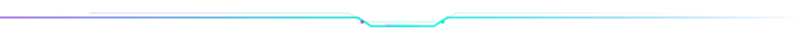

<!-- SECTION 3: QUICK FACTS -->
<!-- 
Présentation sous forme de cartes d'informations clés (Quick Facts)
Utilisation du dashboard SVG conçu localement qui s'adapte de manière responsive.
-->
<h2 align="left" style="color: #9b5de5; font-family: 'Segoe UI', sans-serif;">
   
  Faits Marquants
</h2>

  <!-- Tableau de bord SVG regroupant les 6 faits demandés -->
  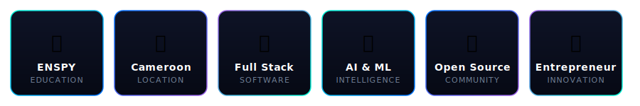

 

<!-- Séparateur visuel SVG -->

  

<!-- SECTION 4: TECHNOLOGIES -->
<!--
Présentation des compétences techniques organisées par catégories.
Chaque badge utilise la palette de couleur du profil (Bleu, Violet, Cyan).
-->
<h2 align="left" style="color: #00f5d4; font-family: 'Segoe UI', sans-serif;">
   
  Technologies &amp; Compétences
</h2>

<table width="100%" border="0" cellspacing="0" cellpadding="8" style="border-collapse: collapse; border: none; margin-top: 15px;">
  <!-- Catégorie: Frontend & Backend -->
  <tr style="border: none;">
    <td width="50%" valign="top" style="border: none; padding-right: 10px;">
      <fieldset style="border: 1px solid #1e293b; border-radius: 8px; padding: 15px; background-color: #0d1117;">
        <legend style="color: #00f5d4; font-weight: bold; font-family: 'Segoe UI', sans-serif; padding: 0 10px;">⚡ Frontend Development</legend>
        

          <!-- HTML5 -->
          
          <!-- CSS3 -->
          
          <!-- JavaScript -->
          
          <!-- TypeScript -->
          
          <!-- React -->
          
          <!-- Next.js -->
          
          <!-- Tailwind CSS -->
          
        

      </fieldset>
    </td>
    <td width="50%" valign="top" style="border: none; padding-left: 10px;">
      <fieldset style="border: 1px solid #1e293b; border-radius: 8px; padding: 15px; background-color: #0d1117;">
        <legend style="color: #9b5de5; font-weight: bold; font-family: 'Segoe UI', sans-serif; padding: 0 10px;">⚙️ Backend Systems</legend>
        

          <!-- Python -->
          
          <!-- FastAPI -->
          
          <!-- Java -->
          
          <!-- Spring Boot -->
          
          <!-- Node.js -->
          
        

      </fieldset>
    </td>
  </tr>
  <!-- Catégorie: Databases & Cloud -->
  <tr style="border: none;">
    <td width="50%" valign="top" style="border: none; padding-right: 10px; padding-top: 15px;">
      <fieldset style="border: 1px solid #1e293b; border-radius: 8px; padding: 15px; background-color: #0d1117;">
        <legend style="color: #0072ff; font-weight: bold; font-family: 'Segoe UI', sans-serif; padding: 0 10px;">💾 Databases &amp; Storage</legend>
        

          <!-- PostgreSQL -->
          
          <!-- MySQL -->
          
          <!-- MongoDB -->
          
          <!-- Cassandra -->
          
          <!-- ScyllaDB -->
          
          <!-- Supabase -->
          
        

      </fieldset>
    </td>
    <td width="50%" valign="top" style="border: none; padding-left: 10px; padding-top: 15px;">
      <fieldset style="border: 1px solid #1e293b; border-radius: 8px; padding: 15px; background-color: #0d1117;">
        <legend style="color: #00f5d4; font-weight: bold; font-family: 'Segoe UI', sans-serif; padding: 0 10px;">☁️ Cloud &amp; DevOps</legend>
        

          <!-- Docker -->
          
          <!-- Linux -->
          
          <!-- Git -->
          
          <!-- GitHub -->
          
        

      </fieldset>
    </td>
  </tr>
</table>

<!-- Catégorie: IA / Machine Learning (Pleine Largeur) -->

  <fieldset style="border: 1px solid #1e293b; border-radius: 8px; padding: 15px; background-color: #0d1117;">
    <legend style="color: #9b5de5; font-weight: bold; font-family: 'Segoe UI', sans-serif; padding: 0 10px;">🧠 Artificial Intelligence &amp; Machine Learning</legend>
    

      <!-- TensorFlow -->
      
      <!-- PyTorch -->
      
      <!-- OpenCV -->
      
      <!-- Scikit-Learn -->
      
      <!-- LangChain -->
      
      <!-- Hugging Face -->
      
    

  </fieldset>

 

<!-- Séparateur visuel SVG -->

  

<!-- SECTION 5: GITHUB STATS -->
<!--
Regroupement de tous les outils de statistiques GitHub (Readme Stats, Languages, Streak, 
Activity Graph, Snake Animation et Trophies).
Les URL sont configurées avec le nom d'utilisateur samuel200220 et harmonisées.
-->
<h2 align="left" style="color: #9b5de5; font-family: 'Segoe UI', sans-serif;">
   
  Statistiques GitHub &amp; Activité
</h2>

  <!-- GitHub Profile Trophies -->
  

 

<table width="100%" border="0" cellspacing="0" cellpadding="5" style="border-collapse: collapse; border: none; margin-top: 10px;">
  <tr style="border: none;">
    <!-- Colonne 1: Stats Générales -->
    <td width="50%" align="center" valign="top" style="border: none; padding: 5px;">
      
    </td>
    <!-- Colonne 2: Top Langages -->
    <td width="50%" align="center" valign="top" style="border: none; padding: 5px;">
      
    </td>
  </tr>
  <tr style="border: none;">
    <!-- Colonne 1 (Ligne 2): Streak Stats -->
    <td width="50%" align="center" valign="top" style="border: none; padding: 5px; padding-top: 15px;">
      
    </td>
    <!-- Colonne 2 (Ligne 2): Contribution Snake (Génération automatique) -->
    <td width="50%" align="center" valign="middle" style="border: none; padding: 5px; padding-top: 15px;">
      <fieldset style="border: 1px solid #1e293b; border-radius: 8px; padding: 15px; background-color: #0d1117; height: 165px; display: flex; flex-direction: column; justify-content: center; align-items: center;">
        <legend style="color: #00f5d4; font-weight: bold; font-family: 'Segoe UI', sans-serif; padding: 0 10px;">🐍 Contribution Snake Game</legend>
        <!-- Animation Snake en SVG. Elle sera mise à jour via le Workflow GitHub Actions fourni dans la doc -->
        
      </fieldset>
    </td>
  </tr>
</table>

 

<!-- Activity Graph -->

  <fieldset style="border: 1px solid #1e293b; border-radius: 8px; padding: 15px; background-color: #0d1117;">
    <legend style="color: #9b5de5; font-weight: bold; font-family: 'Segoe UI', sans-serif; padding: 0 10px;">📊 Activity Graph</legend>
    
  </fieldset>

 

<!-- Workflow Details for Snake Game -->
<!-- 
Ce bloc explicatif permet à l'utilisateur de comprendre comment configurer l'Action GitHub 
qui générera l'image animée du serpent (Contribution Snake).
-->

  

    ⚙️ Comment activer l'animation du serpent (Snake Game) ?
  

  

    
Pour faire fonctionner le serpent animé sur votre profil, créez un fichier de workflow GitHub Action dans votre dépôt :

    <ol>
      <li>Créez le dossier <code>.github/workflows/</code> à la racine de ce projet.</li>
      <li>Créez un fichier nommé <code>snake.yml</code> à l'intérieur.</li>
      <li>Collez-y le code de configuration YAML ci-dessous :</li>
    </ol>
    <pre style="background-color: #1a202c; color: #e2e8f0; padding: 15px; border-radius: 6px; overflow-x: auto; font-family: 'Fira Code', monospace; font-size: 12px; border: 1px solid #2d3748;">
name: Generate Snake

on:
  schedule:
    # Exécution automatique toutes les 12 heures
    - cron: "0 */12 * * *"
  workflow_dispatch:
  # Exécution à chaque push sur la branche principale
  push:
    branches:
    - main

jobs:
  generate:
    runs-on: ubuntu-latest
    timeout-minutes: 10
    
    steps:
      # Génère l'animation du serpent à partir de l'historique de contributions
      - name: generate-github-contribution-grid-snake.svg
        uses: Platane/snk/svg-only@v3
        with:
          github_user_name: ${{ github.repository_owner }}
          outputs: |
            dist/github-contribution-grid-snake.svg
            dist/github-contribution-grid-snake-dark.svg?palette=github-dark
          
      # Déploie l'image générée sur la branche 'output'
      - name: push github-contribution-grid-snake.svg to the output branch
        uses: crazy-max/ghaction-github-pages@v3.1.0
        with:
          target_branch: output
          build_dir: dist
        env:
          GITHUB_TOKEN: ${{ secrets.GITHUB_TOKEN }}
    </pre>
    
Une fois poussé sur GitHub, l'Action s'exécutera automatiquement et créera l'animation à l'emplacement lu par le README.

  

 

<!-- Séparateur visuel SVG -->

  

<!-- SECTION 6: FEATURED PROJECTS -->
<!--
Cette section met en avant 6 projets majeurs sous forme de cartes d'aspect 3D futuriste.
Chaque carte est un fichier SVG local stocké dans assets/ et encapsulé dans un lien cliquable 
dirigeant vers le dépôt du projet.
-->
<h2 align="left" style="color: #00f5d4; font-family: 'Segoe UI', sans-serif;">
   
  Projets Phares
</h2>

<table width="100%" border="0" cellspacing="0" cellpadding="8" style="border-collapse: collapse; border: none; margin-top: 15px;">
  <!-- Projets Ligne 1: Farcal & FoodChain AI -->
  <tr style="border: none;">
    <!-- Projet 1: Farcal -->
    <td width="50%" align="center" style="border: none; padding: 10px;">
      <a href="https://github.com/samuel200220/farcal" target="_blank">
        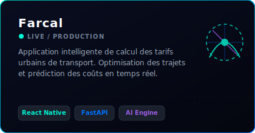
      </a>
    </td>
    <!-- Projet 2: FoodChain AI -->
    <td width="50%" align="center" style="border: none; padding: 10px;">
      <a href="https://github.com/samuel200220/foodchain-ai" target="_blank">
        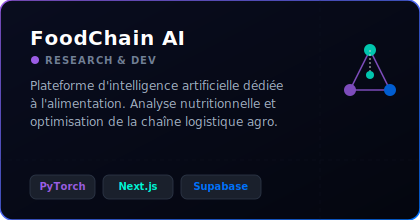
      </a>
    </td>
  </tr>
  <!-- Projets Ligne 2: Datacenter Project & Ride&Go -->
  <tr style="border: none;">
    <!-- Projet 3: Datacenter Project -->
    <td width="50%" align="center" style="border: none; padding: 10px;">
      <a href="https://github.com/samuel200220/datacenter-project" target="_blank">
        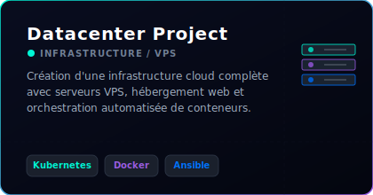
      </a>
    </td>
    <!-- Projet 4: Ride&Go -->
    <td width="50%" align="center" style="border: none; padding: 10px;">
      <a href="https://github.com/samuel200220/ridego" target="_blank">
        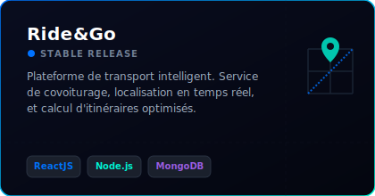
      </a>
    </td>
  </tr>
  <!-- Projets Ligne 3: YowPainter & EduAI -->
  <tr style="border: none;">
    <!-- Projet 5: YowPainter -->
    <td width="50%" align="center" style="border: none; padding: 10px;">
      <a href="https://github.com/samuel200220/yowpainter" target="_blank">
        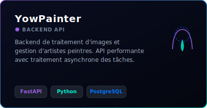
      </a>
    </td>
    <!-- Projet 6: EduAI -->
    <td width="50%" align="center" style="border: none; padding: 10px;">
      <a href="https://github.com/samuel200220/eduai" target="_blank">
        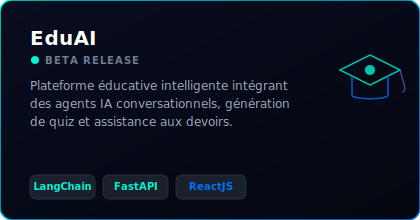
      </a>
    </td>
  </tr>
</table>

 

<!-- Séparateur visuel SVG -->

  

<!-- SECTION 7: CURRENT GOALS -->
<!--
Présentation d'une feuille de route (Roadmap) interactive et graphique décrivant les objectifs.
Affichage de l'arbre technologique SVG conçu localement.
-->
<h2 align="left" style="color: #9b5de5; font-family: 'Segoe UI', sans-serif;">
   
  Feuille de Route &amp; Objectifs
</h2>

  <!-- Intégration de la roadmap SVG locale -->
  

 

<!-- Séparateur visuel SVG -->

  

<!-- SECTION 8: CERTIFICATIONS -->
<!--
Affichage des certifications académiques et professionnelles sous forme de grille de cartes.
Les cartes d'apprentissage automatique de Coursera sont des SVGs pré-dessinés en local.
-->
<h2 align="left" style="color: #00f5d4; font-family: 'Segoe UI', sans-serif;">
   
  Certifications Récentes
</h2>

<table width="100%" border="0" cellspacing="0" cellpadding="8" style="border-collapse: collapse; border: none; margin-top: 15px;">
  <tr style="border: none;">
    <!-- Certification 1: Machine Learning -->
    <td width="50%" align="center" style="border: none; padding: 10px;">
      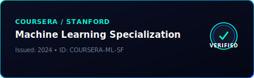
    </td>
    <!-- Certification 2: Advanced Learning Algorithms -->
    <td width="50%" align="center" style="border: none; padding: 10px;">
      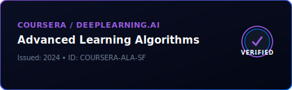
    </td>
  </tr>
</table>

 

<!-- Séparateur visuel SVG -->

  

<!-- SECTION 9: HACKATHONS -->
<!--
Frise chronologique graphique illustrant les hackathons auxquels Samuel a participé.
Le flux utilise le fichier local assets/hackathons-timeline.svg.
-->
<h2 align="left" style="color: #9b5de5; font-family: 'Segoe UI', sans-serif;">
   
  Compétitions &amp; Hackathons
</h2>

  <!-- Intégration de la frise chronologique SVG -->
  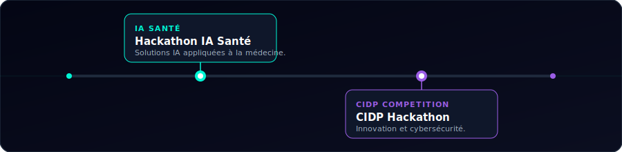

 

<!-- Séparateur visuel SVG -->

  

<!-- SECTION 10: GITHUB METRICS -->
<!--
Ajout des compteurs dynamiques de profil (visiteurs, étoiles, followers et dépôts)
pour une mesure permanente de l'activité du profil.
-->
<h2 align="left" style="color: #00f5d4; font-family: 'Segoe UI', sans-serif;">
   
  Métriques de Profil
</h2>

<table width="100%" border="0" cellspacing="0" cellpadding="5" align="center" style="border-collapse: collapse; border: none; margin-top: 15px;">
  <tr style="border: none;" align="center">
    <!-- Visiteurs -->
    <td style="border: none; padding: 5px;">
      
    </td>
    <!-- Étoiles -->
    <td style="border: none; padding: 5px;">
      
    </td>
    <!-- Followers -->
    <td style="border: none; padding: 5px;">
      
    </td>
    <!-- Dépôts -->
    <td style="border: none; padding: 5px;">
      
    </td>
  </tr>
</table>

 

<!-- Séparateur visuel SVG -->

  

<!-- SECTION 11: CONTACT & SOCIALS -->
<!--
Section de contact premium sous forme de boutons de type bouton d'interface.
Chaque badge pointe vers une adresse ou un profil du développeur.
-->
<h2 align="left" style="color: #9b5de5; font-family: 'Segoe UI', sans-serif;">
   
  Restons Connectés !
</h2>

  Vous avez un projet innovant à développer ou souhaitez collaborer sur des initiatives open-source en IA ? 
  N'hésitez pas à me contacter via l'un des canaux ci-dessous :

<!-- Boutons Sociaux en HTML Grille alignée -->

  <!-- LinkedIn -->
  
  <!-- Portfolio -->
  
  <!-- Email -->
  
  <!-- GitHub -->
  
  <!-- Twitter/X -->
  

 
 

<!-- SECTION 12: FOOTER -->
<!--
Footer animé de fin indiquant la fermeture de la session utilisateur.
Il utilise le fichier assets/footer-animation.svg.
-->

  <!-- Animation du footer personnalisée en SVG local -->
  

 

<!-- SECTION 13: LISTE DES RESSOURCES ET CONTEXTES UTILS -->
<!-- 
Cette section finale et masquée sert à des fins de documentation technique et d'information 
sur les outils tiers officiels intégrés dans ce profil.
Elle fournit un historique complet pour que d'autres puissent s'inspirer de cette structure.
-->

<h3 align="left" style="color: #718096; font-family: 'Segoe UI', sans-serif; font-size: 1.0em;">🛠️ Ressources &amp; API Tierces Utilisées</h3>

  Ce profil interactif a été conçu en combinant du graphisme vectoriel personnalisé (fichiers SVG locaux du dépôt) et des APIs de statistiques dynamiques. En voici la liste officielle :

<ul style="font-family: 'Segoe UI', sans-serif; font-size: 0.9em; color: #718096; line-height: 1.8;">
  <li><strong>Shields.io Badges :</strong> <a href="https://shields.io" style="color: #00f5d4;">https://shields.io</a> - Génération de badges technologiques et de compteurs à couleurs personnalisées.</li>
  <li><strong>GitHub Readme Stats :</strong> <a href="https://github.com/anuraghazra/github-readme-stats" style="color: #00f5d4;">https://github.com/anuraghazra/github-readme-stats</a> - Pour les cartes de statistiques globales et les langages préférentiels.</li>
  <li><strong>GitHub Readme Streak Stats :</strong> <a href="https://github.com/jonathan-r-g/github-readme-streak-stats" style="color: #00f5d4;">https://github.com/jonathan-r-g/github-readme-streak-stats</a> - Mesure de la régularité des commits.</li>
  <li><strong>GitHub Profile Trophy :</strong> <a href="https://github.com/ryo-ma/github-profile-trophy" style="color: #00f5d4;">https://github.com/ryo-ma/github-profile-trophy</a> - Affichage des succès et des trophées de contributions.</li>
  <li><strong>GitHub Readme Activity Graph :</strong> <a href="https://github.com/Ashutosh00710/github-readme-activity-graph" style="color: #00f5d4;">https://github.com/Ashutosh00710/github-readme-activity-graph</a> - Visualisation sous forme de courbe de l'activité.</li>
  <li><strong>Typing SVG Tool :</strong> <a href="https://github.com/DenverCoder1/readme-typing-svg" style="color: #00f5d4;">https://github.com/DenverCoder1/readme-typing-svg</a> - Effet d'écriture dynamique pour la section Hero.</li>
  <li><strong>Snake Contribution Animation (Platane/snk) :</strong> <a href="https://github.com/Platane/snk" style="color: #00f5d4;">https://github.com/Platane/snk</a> - Génération automatique du jeu de serpent en SVG.</li>
  <li><strong>Animated Emojis (Tarikul Islam Anik) :</strong> <a href="https://github.com/Tarikul-Islam-Anik/Animated-Fluent-Emojis" style="color: #00f5d4;">https://github.com/Tarikul-Islam-Anik/Animated-Fluent-Emojis</a> - Emojis animés 3D de Microsoft Fluent pour les en-têtes de section.</li>
</ul>

  <code style="color: #4a5568; font-size: 0.8em; font-family: monospace;">Dernière mise à jour du profil : Juin 2026</code>

